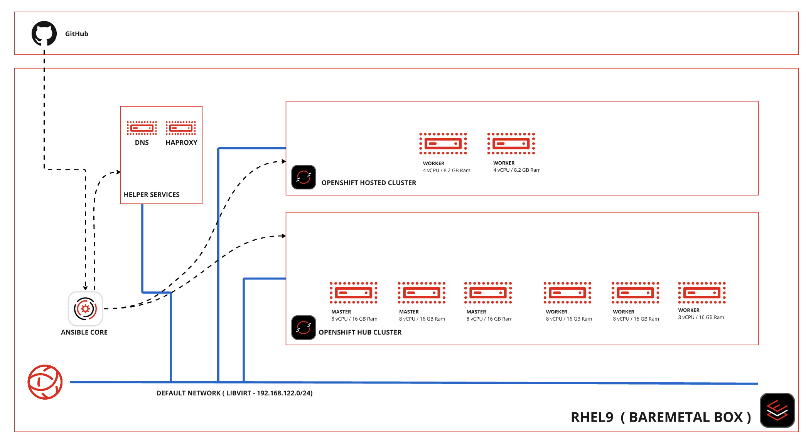

# Hosted Control Planes on a Single BareMetal. 
HCP on BareMetal

This Repo will host the process for deploying a Hosted Control Plane cluster on a Hub Cluster installed on a single bare metal node. 
We are leveraging RHEL9 as our operating system and KVM/Libvirt as our choice of hypervisor to host/simulate actual clusters. 





## PreRequisites

Start with freshly installed RHEL 9.5 OS on the Bare Metal. If the host is not RHEL9.5, we recommend upgrading to RHEL9.5. 
Make sure you have valid subscriptions. 

```
subscription-manager register
yum install ansible-core -y
ansible-galaxy collection install community.libvirt
ansible-galaxy collection install community.crypto
```

Also download `rhel-9.4-x86_64-kvm.qcow2` from access.redhat.com/downloads. 

```
git clone https://github.com/v2pkthakur/hcp-on-bm.git
cp rhel-9.4-x86_64-kvm.qcow2 hcp-on-bm/roles/setup-bm-host/files/
```

Pull the Ansible Repo and explore the inventory and variables and update where required. 

For example, if you got a newer version of RHEL9 Qcow instead of RHEL9.4, please update `rhel9_kvm_image`. 

```
vim vars.yaml
...
rhel9_kvm_image: rhel-9.5-x86_64-kvm.qcow2
... 
```
## Getting Started
We are using ansible-vault to store RHEL activation keys and PullSecret to install OCP cluster. 
```
ansible-vault create vault.yaml
New Vault password:
Confirm New Vault password:

org_id: XXXX
activation_key: YYYYY
pull_secret: 'ZZZZZZZZZZZZZZZZZZZZZZZZZZZZZZZZZ'
```
And we are all set to begin

Lets start with setting up the Bare Metal Host. 
```
[root@base hcp-on-bm]# ansible-playbook -i inventory/hosts setup_bm_host.yaml   --ask-vault-pass
Vault password:
```
The above playbook will create and configure a virtual machine named `helper` which will be hosting the DNS and HAProxy for the setup. 

Once we have that ready, let's start setting up the Hub Cluster.  

```
[root@base hcp-on-bm]# ansible-playbook -i inventory/hosts setup_hub_cluster.yaml   --ask-vault-pass
Vault password:
```

## CleanUp

We got cleanup playbooks as well.  
To cleanup all the Hub Cluster VMs and Helper VMs use `cleanup.yaml`. 

```
[root@base hcp-on-bm]# ansible-playbook cleanup.yaml
```

To cleanup only the Hub Cluster VMs use `cleanup-hub.yaml`. 
```
[root@base hcp-on-bm]# ansible-playbook cleanup-hub.yaml
```


